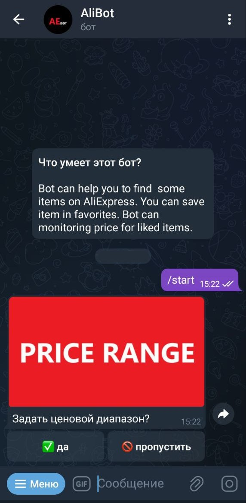
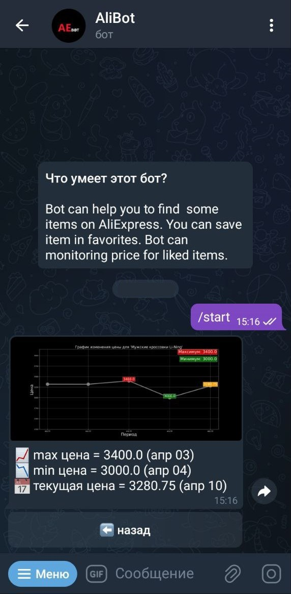
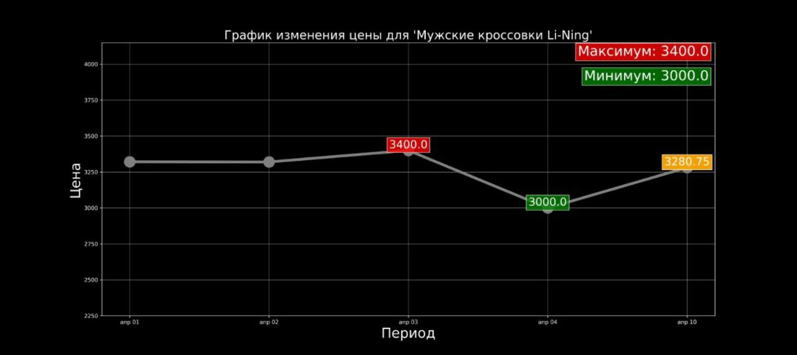
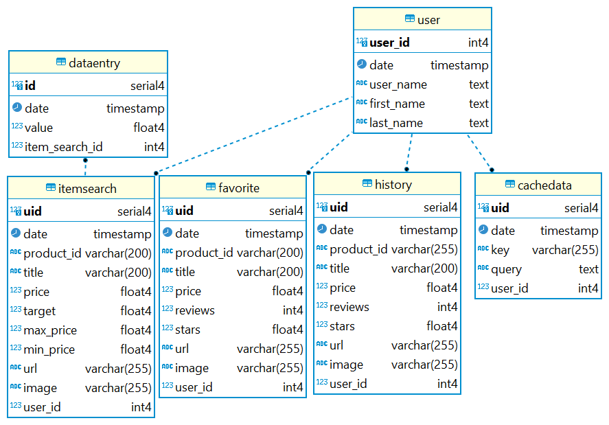

# Телеграм-бот для работы с API интернет-магазина `AliExpress`

Дипломная работа по модулю "Основы Python".

Телеграм-бот по поиску товаров на интернет площадке. А также добавление товаров в 'избранное' и отслеживания цен. 

## 1. Функциональные возможности приложения:
1. Пользователь может искать товары по названию, задавать диапазон цен, сортировать результат поиска.
2. Пользователь может добавлять и удалять товары в `избранное`.
3. Пользователь может видеть историю просмотренных товаров.
4. Пользователь может добавить товар в список по мониторингу цен.
5. Пользователь может задать порог цены, при котором бот отправит сообщение о приемлемой цене.

## 2. В дипломе использовались следующие библиотеки:
* **aiogram** - для создания Telegram-бота. 
* **Postgres** - СУБД для работы с БД.
* **peewee** - библиотека для работы с СУБД.
* **playhouse** - для работы с миграциями.
* **redis** - для хранения с кэшируемыми данными.
* **Docker** - для развёртывания приложения в контейнере

## 3. Структура проекта

Основные файлы проекта:
- logger
- linters
- schema for teacher with levels, callbacks & structure of app

- `bot.py` - основной файл бота
- `config.py` - файл конфигурации
- `handlers/` - папка с обработчиками команд
- `utils/` - вспомогательные утилиты
- `docker-compose.yml` - конфигурация Docker

## 4. Пример интерфейса приложения

### Поиск товара

### История просмотров, график цены, справка

### Пример графика цены отслеживаемого товара


## 5. Зависимости

Чтобы установить зависимости виртуального окружения (*production*) используйте:

```
pip install -r requirements.txt
```

## 6. Конфигурация

Перед запуском необходимо настроить:
1. Создать файл `.env` на основе `.env.example`
2. Указать ваш TELEGRAM_BOT_TOKEN
3. Указать ваш RAPID_API_TOKEN
4. При необходимости настроить другие параметры

## 7. Запуск

Для запуска приложения в docker используйте:

```
docker compose  up --build
```

Для запуска приложения на локальному хосту используйте:

```
python main.py
```
## 8. Доступные команды бота

Основные команды бота:
- `/start` - начать работу с ботом
- `/help` - получить справку по командам
- `/menu` - главное меню
- `/search` - поиск товара
- `/favorite` - избранные товары
- `/monitor` - отслеживаемые товары
- `/history` - история просмотра

## 9. База данных

### База данных состоит из следующих таблиц: 
* `users` 
* `favorites` 
* `history`
* `cachedata`
* `itemsearch`
* `dataentry`

Общая структура таблиц



## 10. Endpoints

| route          | endpoint             | command     | действие                                                 |
|----------------|----------------------|-------------|----------------------------------------------------------|
| BASE ROUTE     |                      |             |                                                          |
|                | start_command        | */start*    | начала работы с ботом                                    |
|                | help_info            | */help*     | вызов справки                                            |
|                | main_menu            | */menu*     | вызов главного меню                                      |
| DETAIL ROUTE   |                      |             |                                                          |
|                | get_item_detail      |             | предоставляет подробную информацию о товаре              |
|                | get_images           |             | возвращает список изображений товара                     |
| FAVORITE ROUTE |                      |             |                                                          |
|                | get_favorite_list    | */favorite* | возвращает список избранных товаров                      |
|                | add_favorite         |             | добавляет в избранные товары                             |
|                | delete_favorite      |             | удаляет из избранных товаров                             |
| HISTORY ROUTE  |                      |             |                                                          |
|                | get_history_list     | */history*  | возвращает список просмотренных товаров                  |
| MONITOR ROUTE  |                      |             |                                                          |
|                | get_monitoring_list  | */monitor*  | возвращает список отслеживаемых товаров                  |
|                | add_monitoring       |             | добавляет товар в список отслеживаемых товаров           |
|                | add_target           |             | предлагает добавить целевую цену                         |
|                | define_target_price  |             | добавляет целевую цену                                   |
|                | delete_monitoring    |             | удаляет товар из списка отслеживаемых товаров            |
|                | send_chart_image     |             | формирует диаграмму цены                                 |
| REVIEW ROUTE   |                      |             |                                                          |
|                | get_review_list      |             | возвращает список комментариев к товару                  |
| SEARCH ROUTE   |                      |             |                                                          |
|                | search_name_message  | */search*   | поисковой запрос (by message)                            |
|                | search_name_callback |             | поисковой запрос (by callback)                           |
|                | search_price_range   |             | запрос на ценовой диапазон                               |
|                | search_price_min     |             | запрос на минимальную цену                               |
|                | search_price_max     |             | запрос на максимальную цену                              |
|                | search_sort          |             | запрос на сортировку поисковой выдачи (с диапазоном цен) |
|                | search_sort_call     |             | запрос на сортировку поисковой выдачи (без диапазона цен)|
|                | search_result        |             | возвращает список товаров                                |
